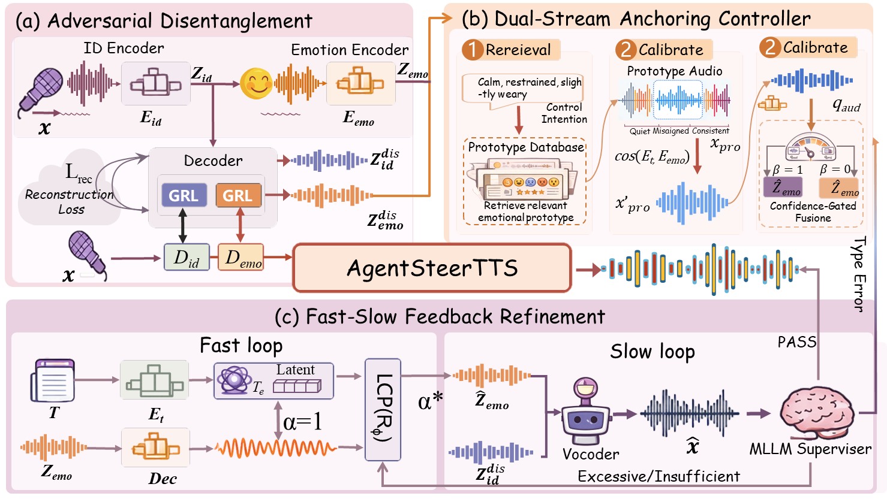
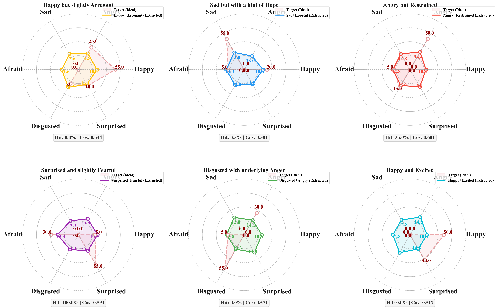
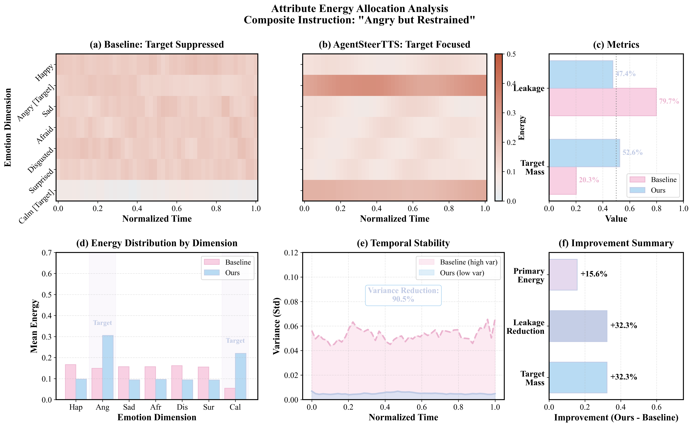
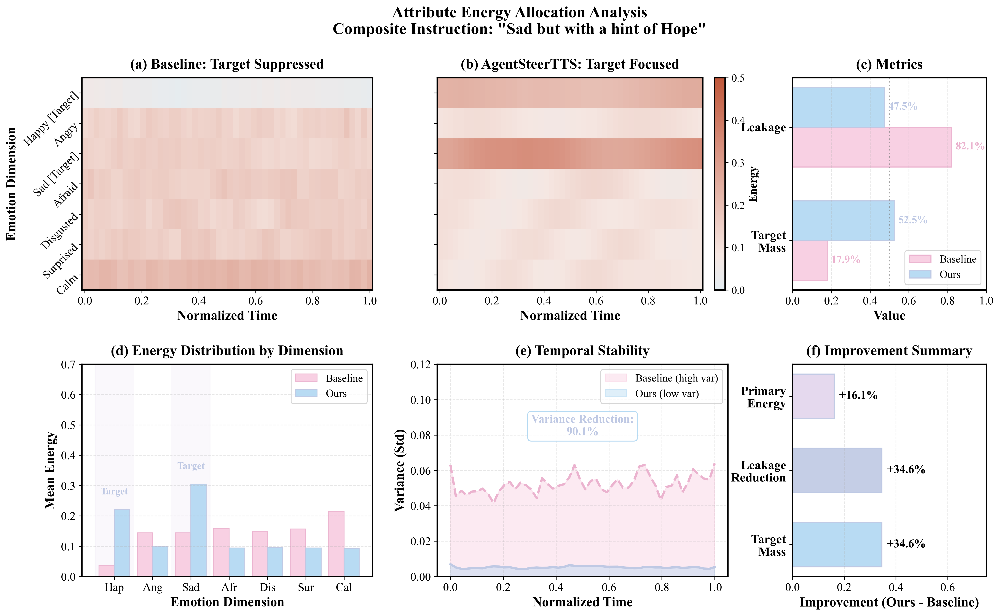

<div align="center">

# AgentSteerTTS

### A Multi-Agent Closed-Loop Framework for Composite-Instruction Text-to-Speech

[](https://arxiv.org/abs/2605.17583)
[](https://kane2kang.github.io/AgentSteerTTS/)
[](https://icml.cc/virtual/2026)

**Bin Kang<sup>1,2,3</sup>, Shaoguo Wen<sup>3</sup>, Yang Fan<sup>2</sup>, Shunlong Wu<sup>4</sup>, Junjie Wang<sup>2</sup>, Yulin Li<sup>2</sup>, Junzhi Zhao<sup>5</sup>, Junle Wang<sup>3</sup>, Zhuotao Tian<sup>2,*</sup>**

<sup>1</sup>University of Chinese Academy of Sciences &nbsp; <sup>2</sup>Shenzhen Loop Area Institute &nbsp; <sup>3</sup>Tencent Turinglab &nbsp; <sup>4</sup>Tsinghua University &nbsp; <sup>5</sup>Southwest Jiaotong University

</div>

---

## Overview

While existing TTS models exhibit high expressiveness, fine-grained control over **composite instructions** (e.g., "*Happy but slightly Arrogant*", "*Sad but with a hint of Hope*") remains challenging due to the structural mismatch between discrete textual intents and continuous acoustic realizations.

**AgentSteerTTS** is a multi-agent closed-loop framework that enables intent-faithful expressive control of composite instructions for text-to-speech synthesis. The model is trained on **180,000+ real game dubbing recordings**, providing rich and diverse emotional coverage for game-quality speech synthesis.

<p align="center">
  
  <br>
  <em>Figure 1: AgentSteerTTS Framework Overview</em>
</p>

## Key Features

- **Composite Emotion Control** &mdash; Synthesize speech with complex, multi-dimensional emotional instructions (e.g., "Angry but Restrained", "Surprised and slightly Fearful")
- **Single Emotion Synthesis** &mdash; High-quality synthesis for standard emotions: Happy, Sad, Angry, Fearful, Surprised, Neutral
- **Emotion Intensity Steering** &mdash; Fine-grained control over emotion intensity levels (Low / Medium / High)
- **Speaker Identity Preservation** &mdash; Maintain consistent speaker timbre across different emotional expressions via zero-shot voice cloning
- **180K Real Game Dubbing Data** &mdash; Trained on large-scale professional game voice-over recordings with rich emotional annotations

## Technical Highlights

### 1. Adversarial Disentanglement Module (ADM)

Mitigates **speaker-emotion leakage** by learning separable identity and emotion-prosody subspaces with leakage-suppressing regularization. This ensures that changing the emotion does not inadvertently alter the speaker's voice identity, and vice versa.

### 2. Dual-Stream Anchoring Controller

- **Retrieval Agent**: Leverages a large-scale acoustic prototype library to retrieve high-expressivity anchors that ground abstract emotional intents with perceptual pruning.
- **Synthesis Agent**: Transforms discrete emotional intents into continuous control vectors through a gated attention fusion mechanism.

### 3. Fast-Slow Feedback Mechanism

A hierarchical closed-loop refinement system:
- **Fast Control Agent**: Performs rapid latent gradient correction for intensity calibration, ensuring the output matches the desired emotion strength.
- **Supervisor Agent**: Provides high-level perceptual critique to resolve semantic-acoustic mismatches, iteratively improving overall expressiveness.

## Research Motivation

Our pilot study reveals that existing TTS models exhibit **systematic biases** when handling composite emotional instructions, failing to faithfully express multi-dimensional emotional intents:

- **Target Suppression**: Target emotion expression drops 25%-45%
- **Energy Leakage**: +0.08 average leakage to irrelevant emotional dimensions
- **Joint Satisfaction**: Only ~30% for composite instructions

<p align="center">
  
  <br>
  <em>Figure 2: Semantic-Acoustic Misalignment in Existing Methods</em>
</p>

## Visualization

AgentSteerTTS precisely controls the intensity balance between composite emotions, achieving nuanced expression that baseline models cannot replicate.

<p align="center">
  
  &nbsp;&nbsp;
  
  <br>
  <em>Figure 3: Attribute energy allocation for "Angry but Restrained" (left) and "Sad but Hopeful" (right)</em>
</p>

## Audio Demos

Visit our [project page](https://kane2kang.github.io/AgentSteerTTS/) for interactive audio demonstrations, including:

| Category | Description |
|---|---|
| **Composite Emotion Control** | Mixed emotional instructions (e.g., "Happy but slightly Arrogant", "Sad but with a hint of Hope") |
| **Single Emotion Benchmark** | Side-by-side comparison across IndexTTS2, CosyVoice2, and AgentSteerTTS |
| **Intensity Steering** | Same text with Low (30%) / Medium (60%) / High (100%) emotion intensity |

## TODO

- [ ] Release inference code
- [ ] Release model checkpoints
- [ ] Release training code
- [ ] Release game dubbing dataset

## Citation

If you find this work useful, please cite our paper:

```bibtex
@misc{kang2026agentsteerttsmultiagentclosedloopframework,
      title={AgentSteerTTS: A Multi-Agent Closed-Loop Framework for Composite-Instruction Text-to-Speech}, 
      author={Bin Kang and Shaoguo Wen and Yang Fan and Shunlong Wu and Junjie Wang and Yulin Li and Junzhi Zhao and Junle Wang and Zhuotao Tian},
      year={2026},
      eprint={2605.17583},
      archivePrefix={arXiv},
      primaryClass={cs.CV},
      url={https://arxiv.org/abs/2605.17583}, 
}
```

## Acknowledgements

This work was supported by the University of Chinese Academy of Sciences, Shenzhen Loop Area Institute, Tencent Turinglab, Tsinghua University, and Southwest Jiaotong University.

## License

This project is released for academic research purposes. Please refer to the license of each component for more details.
